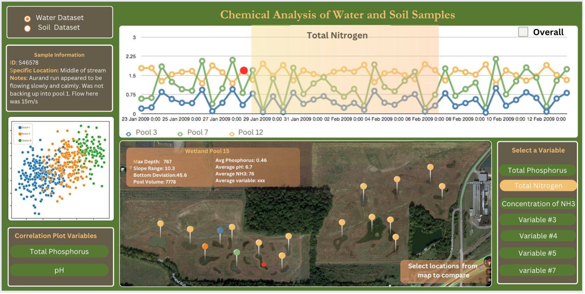

# [Water and Soil Dataset Visualization Project](https://imankhazrak.github.io/Final_project/)

## Overview

This project involves creating visualizations for water and soil datasets acquired from field readings. The goal is to facilitate exploration and analysis of scientific experiment data related to soil and water dynamics. The intended audience for this visualization tool includes domain experts such as professors and graduate students.

## Domain Situation

- **User Request**: The user requests a visualization tool to explore data collected during scientific experiments on soil and water.
- **Audience**: Professors and graduate students in the domain.
- **Technical Constraints**: The use of D3.js is mandated by the instructor.
- **Data Presentation**: Data should be presented in a spatially populated format with supporting plots, without aggregation.

## Data/Task Abstraction

- **Data Characteristics**: The datasets consist of structured, small-sized, static data with spatial and quantitative/qualitative parameters. There are two datasets from the same location: soil samples and water samples.
- **Visualization Requirements**:
  - Visualize each sample's spatial location on a map.
  - Explore spatial dependency and correlations between variables.
  - Allow control over variables and location for comparison purposes.
  - Facilitate exploration of correlations between variables and seasonal trends.

## Visual Encoding/Interaction Layer

- **Dataset Selection**:
  - Radio buttons to choose between soil and water datasets.
- **Spatial Visualization**:
  - Utilize a map (satellite view) to display data's spatial characteristics.
  - Data points collected from 43 pools and other specific locations.
  - Fixed map view (no zooming/panning) to observe dynamics with spatial changes in data.
  - Interactive map pins to represent sampling regions.
    - Hovering over a pin shows location name.
    - Clicking a pin displays detailed information and selects the region for time series plots.
- **Variable Selection**:
  - Lower right panel allows selection of one variable for visualization.
- **Time Series Plot**:
  - Display time series plots for the selected variable and chosen regions.
  - Option to compare trends for specific regions against the overall region.
- **Seasonal Trends**:
  - Overlay seasons as requested by the user.
- **Interaction with Plots**:
  - Highlight selected points on plots and corresponding map locations.
  - Display sample details when a point is selected.
- **Correlation Analysis**:
  - Use scatter plots to explore correlations between two selected variables.
  - Color points based on seasons for visual distinction.
- **Visual Design**:
  - Use a color scheme harmonious with the satellite map and dataset theme.

 ## Deployment

The project is deployed and accessible at the following URL:

[View Deployment](https://imankhazrak.github.io/Final_project/)

## Contributors

- **Shakhnoza Takhirova**: Created the overall design and selected implementation tools.
- **Iman Khazrak**: Implemented data analysis plots.
- **Jafar Mohseni**: Developed the project using D3.js, HTML, React.js, and CSS.

